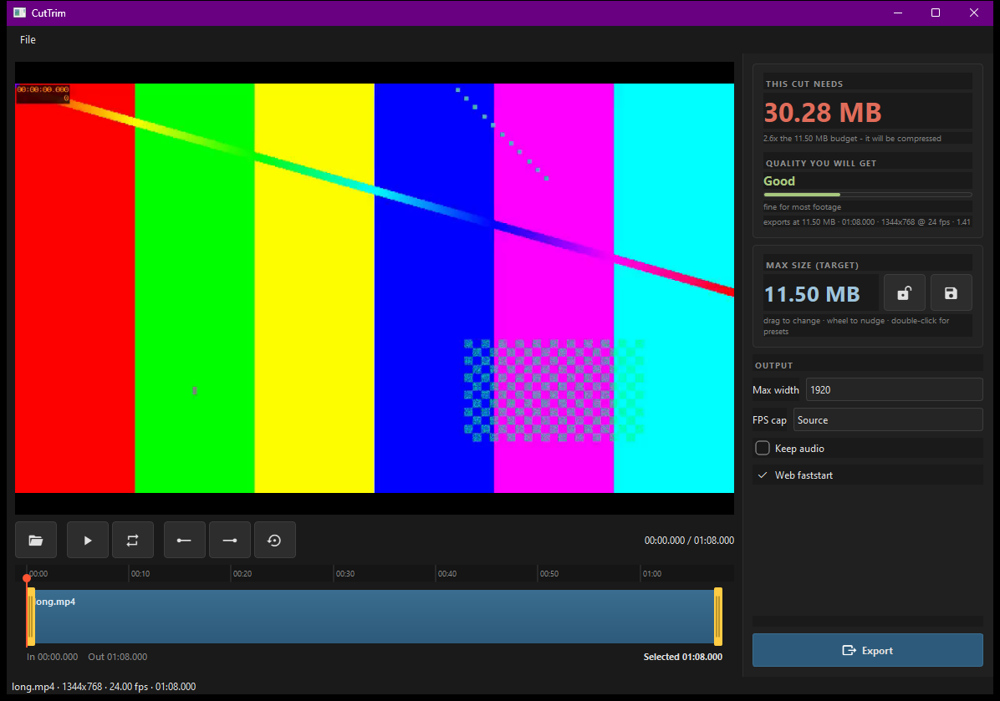

# Undercut

**Cut it, keep it under.**

Load a video, pick an in/out range, and see whether it fits your size budget
before you export. Built for cargo.collective gallery thumbnails, which must
come in under 12 MB.



---

## Requirements

- Python 3.11+
- `pip install -r requirements.txt` (PySide6, PyAV, QtAwesome)
- **ffmpeg** on PATH, or in `C:\ffmpeg\bin` (metadata is read via PyAV; only
  encoding shells out)

## Run

```bat
python main.py
python main.py clip.mp4      REM open a file straight away
```

Drag-and-drop a video onto the window works too.

---

## How it works

You set a **max size** (11.5 MB by default). The bitrate is solved backwards
from that target, so the export always lands on it - two-pass encoding gets
within about 2%.

The panel shows the two numbers as a pair:

- **THIS CUT NEEDS** - what the selection would take to look visually
  transparent at the chosen resolution. This moves as you drag the handles.
- **MAX SIZE (TARGET)** - the ceiling you are steering. Drag or scroll the
  number to change it, lock it once you are happy, or save it as a preset.

- **green** - the selection fits inside your budget with room to spare
- **amber / red** - it needs more than the budget, so it will be compressed
  (the note says by how much, e.g. "2.6x the 11.50 MB budget")

Underneath, **quality you will get** translates that into plain terms:

| reading | meaning |
|---|---|
| Excellent | visually lossless at this size |
| Very good | clean, safe for detailed footage |
| Good | fine for most footage |
| Fair | soft on motion or grain |
| Poor | shorten the cut, or drop the resolution |

The two levers are **duration** and **resolution**. A 68 s cut at 1344x768
needs 30 MB (2.6x over, "Good"); trimming to 15 s brings it to 6.7 MB and
"Excellent". Dropping Max width to 1280 does the same thing without shortening
the cut.

**The target is a ceiling, not a quota.** A cut that needs less than the budget
exports smaller rather than being padded up to it - an 8.8 s cut needing 3.93 MB
comes out at 3.94 MB, not 11.5 MB.

Measured export accuracy: predicted 3.93 MB -> actual 3.94 MB (**0.2% drift**),
with the output duration matching the selection exactly.

---

## Controls

| Action | How |
|---|---|
| Open | Folder button, drag-and-drop, or `Ctrl+O` |
| Set in / out | Drag the yellow handles, or `I` / `O` at the playhead |
| Slide the selection | Drag the middle of the blue block - keeps the length, and so the size, while you pick a different part of the clip |
| Speed up | **Speed slider** (1x-5x) - drops frames, so the export gets shorter and smaller; double-click to reset |
| Scrub | Click or drag anywhere on the strip |
| Play / pause | `Play` button or `Space` (plays the selection) |
| Loop | Loop button or `L` - repeats the selection |
| Change max size | **Drag the big MB number**, or scroll on it (`Ctrl` fine, `Shift` coarse) |
| Lock the target | Padlock button - stops accidental changes |
| Size presets | **Double-click the number** or the save button - pick, save or delete |
| Open the export | `Play <file>` after exporting; `Ctrl`+click reveals it in Explorer |
| Nudge | `←` / `→` one frame, `Shift` for one second |
| Reset selection | Reset button, or `Ctrl+A` - back to the whole clip |
| Export | `Export`, or `Ctrl+E` |

The toolbar is icon-only - hover any button for its name and shortcut. Toggle
buttons (loop, lock) turn blue when active.

---

## Preview performance

Decoding runs on **PyAV** with `FRAME` threading, which matters a lot for
seeking (measured on 1080p h264 random seeks):

| thread mode | median seek |
|---|---|
| default (1 thread) | 76.5 ms |
| `SLICE` ×8 | 74.3 ms |
| `AUTO` | 24.9 ms |
| **`FRAME` ×8** | **17.2 ms** |

`SLICE` is *slower than single-threaded* for seeking — a real trap.

On top of that, large or long-GOP sources get a 540p preview proxy built in the
background (under a second, ~1 MB). Export always reads the original.

| source | direct | via proxy | |
|---|---|---|---|
| 1080p | 50 ms (20 fps) | **8.7 ms (111 fps)** | 5.7× |
| long-GOP 1080p | 192 ms (5 fps) | 11.4 ms (87 fps) | 16.8× |
| 4K UHD | 96 ms (10 fps) | 10.1 ms (99 fps) | 9.5× |

While you drag, frames come from an in-memory cache (~0.001 ms) so the picture
tracks the cursor; the exact frame is decoded when you let go.

---

## Tests

```bat
python test_app.py <clip.mp4>
```

Covers the selection model (including in/out crossing), the size and quality
estimates, a real two-pass export checked against the target, scrub latency,
EOF handling, and the window end-to-end.

---

## Layout

```
Undercut/
├── main.py                 entry point
├── app/
│   ├── ffmpeg_tools.py     binary discovery + PyAV metadata probe
│   ├── decoder.py          PyAV decode, seek, LRU frame cache
│   ├── proxy.py            background preview proxy + cache
│   ├── playback.py         decode thread, scrub coalescing
│   ├── estimator.py        size <-> bitrate math, quality bands
│   ├── model.py            the video, the in/out range, settings
│   ├── encoder.py          ffmpeg command building, 2-pass
│   ├── trimbar.py          the in/out selection strip
│   └── window.py           main window, preview, readout
└── build.bat               PyInstaller onedir build
```

`_v2_twotrack/` holds an earlier two-track timeline version, kept only for
reference.

## Known limits

- One video at a time; no joining clips (that was v2, deliberately dropped).
- Preview has no audio; exported files keep theirs when "Keep audio" is on.
- Proxy cache lives in `%TEMP%\undercut_proxies`, trimmed to ~1.5 GB on startup.

---

## Licence

GPL-3.0. See [LICENSE](LICENSE).

The app icon is derived from the "underline" mark in
[Lucide](https://lucide.dev/icons/underline), used under the ISC licence.
Interface icons come from [Material Design Icons](https://pictogrammers.com/library/mdi/)
via [QtAwesome](https://github.com/spyder-ide/qtawesome).
